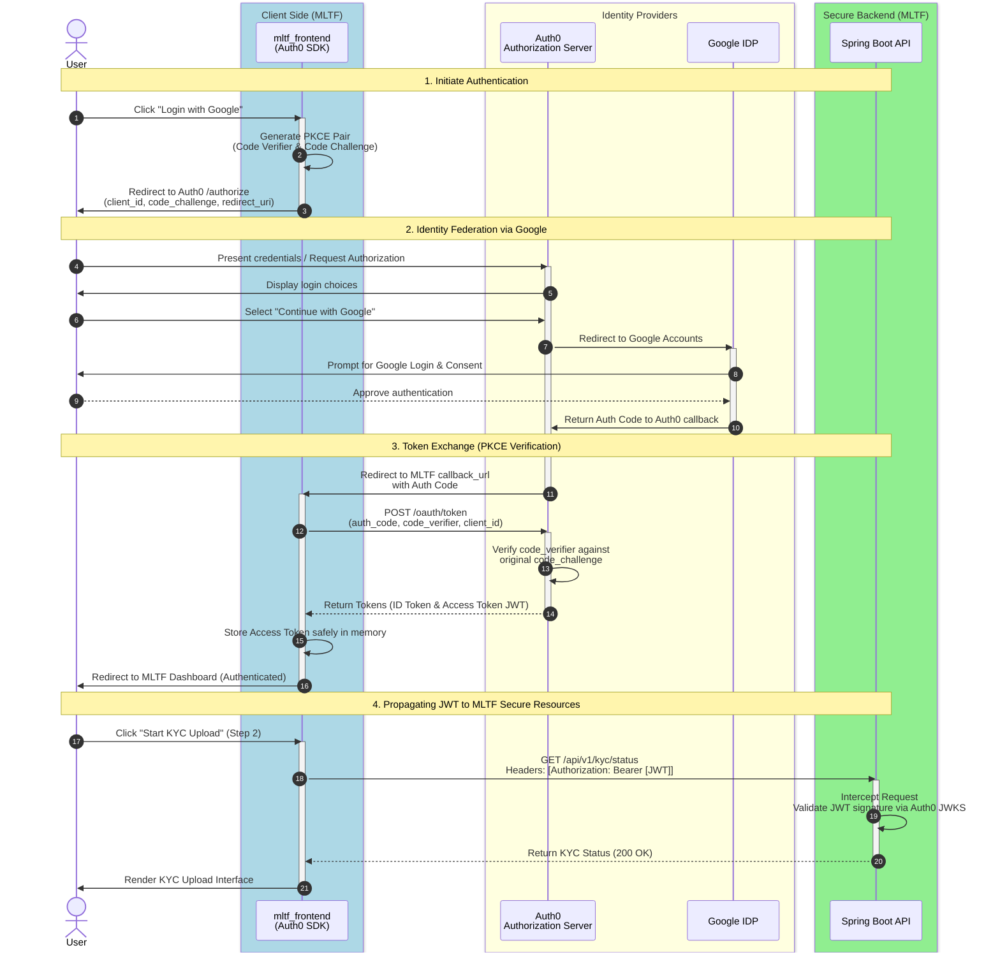

# FUNCTIONAL SPECIFICATION DOCUMENT (v3)
## Project MLTF: Mortgage Loan for the Future (Automated Agentic Underwriting & Relational Graph Fraud Analytics)

---

## 1. Authenticate User

```mermaid
sequenceDiagram
    autonumber

    actor User as User

    box LightBlue Client Side (MLTF)
        participant Frontend as mltf_frontend<br/>(Auth0 SDK)
    end

    box LightYellow Identity Providers
        participant Auth0 as Auth0<br/>Authorization Server
        participant Google as Google IDP
    end

    box LightGreen Secure Backend (MLTF)
        participant Backend as Spring Boot API
    end

    %% 1. Initiate Authentication
    Note over User,Backend: 1. Initiate Authentication
    User->>Frontend: Click "Login with Google"
    activate Frontend
    Frontend->>Frontend: Generate PKCE Pair<br/>(Code Verifier & Code Challenge)
    Frontend->>User: Redirect to Auth0 /authorize<br/>(client_id, code_challenge, redirect_uri)
    deactivate Frontend

    %% 2. Identity Federation via Google
    Note over User,Backend: 2. Identity Federation via Google
    User->>Auth0: Present credentials / Request Authorization
    activate Auth0
    Auth0->>User: Display login choices
    User->>Auth0: Select "Continue with Google"
    Auth0->>Google: Redirect to Google Accounts
    activate Google
    Google->>User: Prompt for Google Login & Consent
    User-->>Google: Approve authentication
    Google->>Auth0: Return Auth Code to Auth0 callback
    deactivate Google

    %% 3. Token Exchange (PKCE Verification)
    Note over User,Backend: 3. Token Exchange (PKCE Verification)
    Auth0->>Frontend: Redirect to MLTF callback_url<br/>with Auth Code
    deactivate Auth0
    activate Frontend

    Frontend->>Auth0: POST /oauth/token<br/>(auth_code, code_verifier, client_id)
    activate Auth0
    Auth0->>Auth0: Verify code_verifier against<br/>original code_challenge
    Auth0-->>Frontend: Return Tokens (ID Token & Access Token JWT)
    deactivate Auth0

    Frontend->>Frontend: Store Access Token safely in memory
    Frontend->>User: Redirect to MLTF Dashboard (Authenticated)
    deactivate Frontend

    %% 4. Propagating JWT to MLTF Secure Resources
    Note over User,Backend: 4. Propagating JWT to MLTF Secure Resources
    User->>Frontend: Click "Start KYC Upload" (Step 2)
    activate Frontend
    Frontend->>Backend: GET /api/v1/kyc/status<br/>Headers: [Authorization: Bearer [JWT]]
    activate Backend
    Backend->>Backend: Intercept Request<br/>Validate JWT signature via Auth0 JWKS
    Backend-->>Frontend: Return KYC Status (200 OK)
    deactivate Backend
    Frontend->>User: Render KYC Upload Interface
    deactivate Frontend
```
