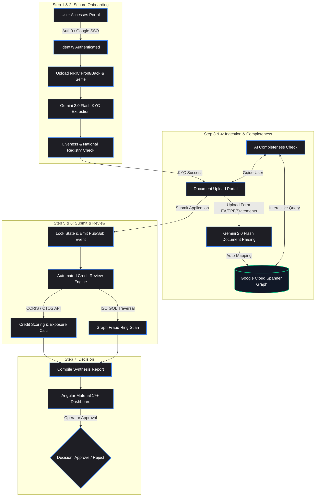
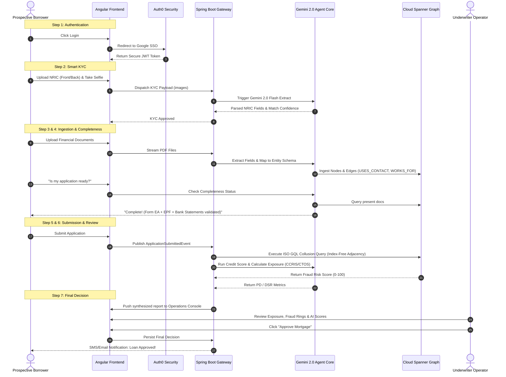

# FUNCTIONAL SPECIFICATION DOCUMENT (v3)
## Project MLTF: Mortgage Loan for the Future (Automated Agentic Underwriting & Relational Graph Fraud Analytics)

---

## 1. Executive Summary: The RM47.3 Billion Disruption Opportunity

In the Malaysian banking ecosystem, mortgage loan origination is an archaic, document-heavy, and high-friction process. Managing a massive monthly volume of **RM47.3 billion in property finance applications** (recorded in February 2025) has pushed manual compliance and underwriting workflows past their breaking point. 

Currently, Malaysian banks face three compounding crises:
1. **Severe Processing Latency:** While core loan decisions can be compiled in 2–9 working days, the end-to-end cycle—including document collection, validation, and queue bottlenecks—takes **15 to 22 calendar days**.
2. **Tabular Isolation & "Relational Blindness":** Traditional credit evaluation systems process mortgage applications in strict isolation using legacy relational databases (RDBMS). They are structurally blind to coordinated multi-party **"fraud for profit" schemes**, where collusive fraud rings (comprising corrupt brokers, appraisers, and applicants) share contact numbers, employer details, or down-payment sources across separate, seemingly independent files.
3. **OCR Context Blindness:** Legacy Optical Character Recognition (OCR) systems are expensive, rigid, and prone to transcription errors, failing to comprehend the visual, spatial, and semantic context of submitted documentation.

### The MLTF Solution: 
**MLTF (Mortgage Loan for the Future)** completely overhauls this paradigm. By deploying an advanced, multi-stage digital pipeline integrated with **Google Cloud Spanner Graph** and an **LLM-Based Multi-Agent System (MAS)**, MLTF collapses the end-to-end mortgage processing cycle **from weeks to mere minutes**, elevates fraud detection accuracy to **over 95%**, and provides a transparent, zero-bias underwriting experience.

---

## 2. Updated Functional Scope: The 7-Step Digital Pipeline

MLTF organizes the entire mortgage application lifecycle into a seamless, high-performance, and secure 7-step functional pipeline. 

### GitHub-Native Process Map (Mermaid.js Flowchart)
Below is the interactive, GitHub-native functional flow mapping out the system's operational layers. This renders dynamically in high-resolution vector format directly inside your repository:



---

## 3. End-to-End System Integration & Message Flow

To ensure absolute clarity for engineering and operations, the following sequence diagram maps the exact API communication paths, JWT propagation, and backend agent states during a live mortgage lifecycle check:



---

## 4. Deep-Dive Functional Requirements

### Step 1: User Authentication (Auth0 & Google Integration)
* **Functional Requirement:** The system must restrict portal access to authenticated users. Identity federation must support Google Social Logins, handling seamless token exchanges and automatic session management.
* **Security Controls:** Session validity is asserted via an encrypted JWT bearer token passed in the request header (`Authorization: Bearer <JWT>`). If a session expires or a token is tampered with, the API gateway must instantly reject downstream routing.

### Step 2: Smart KYC Process (ID Verification & Selfie Matching)
* **Functional Requirement:** Prospective borrowers must pass an automated KYC validation step before uploading any mortgage files.
* **Execution Logic:**
  1. User uploads a high-resolution image of the front and back of their Malaysian NRIC, followed by a real-time face capture (selfie).
  2. The system triggers a multimodal extraction query (Gemini 2.0 Flash) to read character data (Name, MyKad Number, Birth Date, Address, Gender) and isolate the NRIC portrait.
  3. A browser-side liveness detection module passes the live selfie to compare facial similarity vectors against the extracted NRIC portrait.
  4. The MyKad details are queried against national KYC sanctions registries via a secure microservice endpoint.
  5. The KYC status is updated to `VERIFIED` only if similarity exceeds 90% and no blacklist hits occur.

### Step 3: Multi-Document Ingestion & Graph Mapping
* **Functional Requirement:** The system must accept, parse, and structure heterogeneous document modalities (e.g., LHDN Form EA, EPF logs, bank statements, and S&P valuations) to build a relational graph network.
* **Execution Logic:**
  1. As each document is uploaded, it is routed to the **Extraction Agent** to map entities out of flat, unstructured formats.
  2. Extracted metadata is automatically structured into property graph elements:
     * **Nodes:** `Applicant`, `ContactInfo` (phone, email, IP), `Employer` (SSM registration), `Property` (parcel block), `Document` (source hash).
     * **Edges:** `USES_CONTACT`, `WORKS_FOR`, `SUBMITTED`, `APPLIES_FOR`.
  3. The parsed records are instantly stored as a linked topology in **Google Cloud Spanner Graph**.

### Step 4: AI-Powered Application Completeness Check
* **Functional Requirement:** The borrower must have access to a real-time, interactive assistant that analyzes their current application checklist and identifies document gaps prior to submission.
* **Execution Logic:**
  1. When clicked, the AI Completeness Check evaluates the present nodes in Spanner Graph against standard credit scoring checklists and Bank Negara Malaysia (BNM) regulations.
  2. If any mandatory documents (e.g., LHDN Form EA or 3 full months of pay slips) are missing, the assistant provides immediate, actionable guidance:
     * *“Your Form EA and 2 months of pay slips have been verified. However, under Bank Negara Malaysia guidelines, you must provide your July 2026 bank statement to satisfy complete income proof. Please upload this file to unlock submission.”*
  3. Once the criteria are satisfied, the frontend submit action is unlocked.

### Step 5: Secure Application Submission
* **Functional Requirement:** Users must be able to securely lock and submit their application.
* **Execution Logic:**
  1. Upon clicking submit, the application state is changed to `SUBMITTED`.
  2. The system emits an asynchronous `ApplicationSubmittedEvent` via **Google Cloud Pub/Sub** containing the transaction payload, triggering the downstream scoring and fraud detection engines in a completely decoupled manner.

### Step 6: Automated Credit Review & Scoring Engine
* **Functional Requirement:** Upon submission, the backend must execute an immediate, automated tri-partite risk assessment:
  * **Exposure Check:** Call internal exposure logs and external credit bureau APIs (CCRIS/CTOS) to get outstanding debt lines.
  * **Graph Fraud Traversal:** Scan the Spanner Graph using index-free adjacency to detect overlapping contact vectors or shared appraiser hashes indicating collusion rings.
  * **AI Credit Score:** Calculate the Debt-Service-Ratio (DSR) and Probability of Default (PD) to generate an objective credit score.
* **ISO GQL Fraud Query:**
  ```sql
  -- High-performance collusion ring scan traversing memory pointers in milliseconds
  MATCH (a1:Applicant)-[:USES_CONTACT]->(c:ContactInfo)<-[:USES_CONTACT]-(a2:Applicant)
  MATCH (a1)-[:WORKS_FOR]->(e:Employer)<-[:WORKS_FOR]-(a2)
  WHERE a1.applicant_id != a2.applicant_id
  RETURN a1.full_name AS Applicant_A, 
         a2.full_name AS Applicant_B, 
         c.value AS Shared_Contact, 
         e.company_name AS Shared_Employer,
         COUNT(*) AS Hop_Count;
  ```

### Step 7: Bank Operational Team Underwriter Review
* **Functional Requirement:** The complete application profile, compiled fraud flags, credit exposure, and credit score must be consolidated into an **Angular Material 17+ Dashboard** for human underwriter sign-off.
* **Execution Logic:**
  1. The operator logs into the backend administrative console.
  2. Each file is presented with transparent SHAP (Explainable AI) values explaining why the AI scored the credit at its given level.
  3. Underwriters review any high-risk highlights (e.g., a flagged collusion match in Spanner Graph) and click `Approve` or `Reject` to persist the final underwriting outcome.

---

## 5. The Hackathon "Wow" Factor: Category-Defining Novelty

1. **Google ADK for Java Integration:** Shifting from passive, rule-based systems to a state-aware multi-agent architecture built natively inside a **Spring Boot 3.x** microservice framework.
2. **Index-Free Adjacency on Spanner Graph:** Eliminating recursive relational SQL JOIN operations ($O(N^k)$) that degrade performance by up to 85% at depth. Spanner Graph traverses direct memory pointers, yielding $O(1)$ scaling regardless of database volume.
3. **Natural Language GraphRAG:** Using Gemini 1.5 Pro to dynamically generate standards-compliant **ISO Graph Query Language (GQL)** queries on the fly, transforming standard document retrieval into context-aware relationship analysis.

---
*Document produced as a technical submission for the MLTF Enterprise Hackathon. Grounded in research on Design Science Methodology (Wieringa, 2014) and Financial-Grade Agentic Architectures.*
